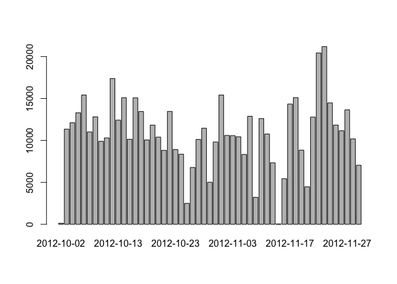
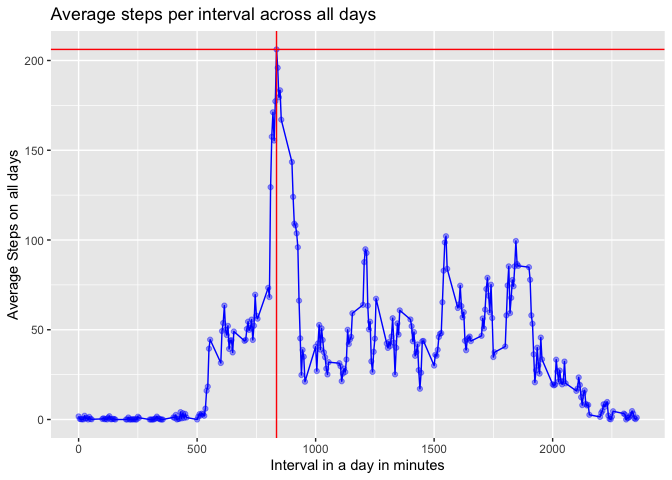
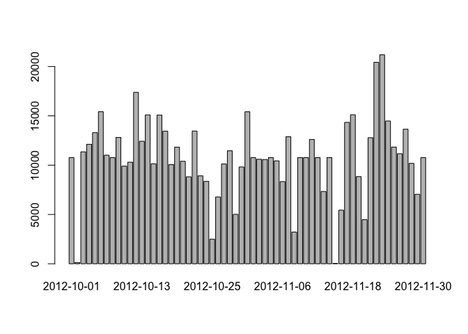
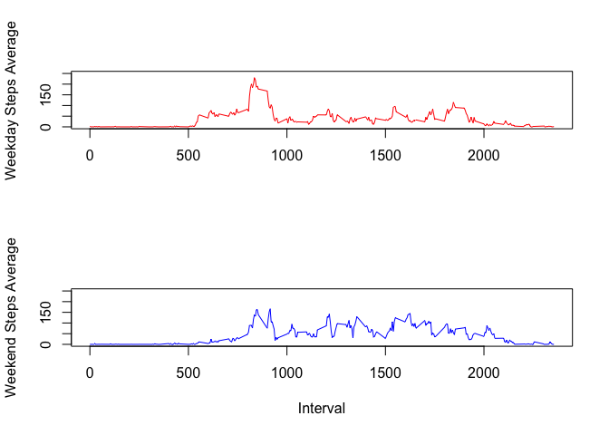

## Loading and preprocessing the data
The below code is used to load the data from the data set file.


```r
rawDF <- read.csv("activity.csv", stringsAsFactors = FALSE)
# the below variable stores the count of places where steps is NA
sumofNA <- sum(is.na(rawDF$steps))
```

So, after loading the data we can see that there are 2304
observations where there are no number of steps mentioned. We will look
at filling the missing values as part of a later section below


## What is mean total number of steps taken per day?

The total number of steps taken per day would be computed by the
following and accordingly a histogram is plotted.Alongside, also calculate
the mean and the median per day.


```r
sumperday <- aggregate(steps~date, rawDF, sum, na.rm = TRUE)
# plot the histogram
barplot(sumperday$steps, names.arg = sumperday$date)
```

<!-- -->

```r
# get the mean and the median of the sum of steps per day
meanperday <- as.character(mean(sumperday$steps))
medianperday <- as.character(median(sumperday$steps))
```

The mean and median of the total of steps per day is 10766.1886792453 and 
10765 respectively. 

## What is the average daily activity pattern?

First lets calculate the aggregate of number of steps taken in each interval
spanned across all the days.


```r
avgperinterval <- aggregate(steps~interval, rawDF, mean, na.rm = TRUE)
#contruct the plot
library(ggplot2)
g <- ggplot(avgperinterval, aes(interval, steps)) + geom_line(color="blue") + geom_point(color="blue", alpha=0.4) + 
  labs(title = "Average steps per interval across all days") + 
  xlab("Interval in a day in minutes") + ylab("Average Steps on all days") + geom_hline(yintercept = max(avgperinterval$steps), color="red") + geom_vline(xintercept = avgperinterval[which.max(avgperinterval$steps),]$interval, color="red")
#plot the chart
g
```

<!-- -->

As seen from the graph the max number of steps per day on an average is
206.1698113 and are taken in 835 interval


## Imputing missing values
As we had seen earlier on, there are 2304 missing values in the
'steps' column of the data set. This was computed using the below,


```r
# the below variable stores the count of places where steps is NA
sumofNA <- sum(is.na(rawDF$steps))
```

Now lets fill in those missing values with
the average number of steps taken in that particular interval.

Point to be noted after some analysis is that for intervals where the
steps are NA, do not have any step recorded for the entire day. Hence
we cannot adopt the strategy to fill the missing values by the average
of steps taken in the day, as there is no information present for that day
to compute the average.


```r
## lets create the data frame with NA values
dfNA <- subset(rawDF, is.na(rawDF$steps))

## Lets find out the means steps per interval across the entire duration
avgperday <- aggregate(steps~interval, rawDF, mean, na.rm = TRUE)

## Now lets fill that NA dataset with mean value of steps in that interval
dfNA$steps <- avgperday$steps[match(dfNA$interval, avgperday$interval)]

## get the non NA data set
NNAdata <- subset(rawDF, !is.na(rawDF$steps))

## Now lets combine the two sets
mergeDF <- rbind(dfNA, NNAdata)

## aggregate by total steps per day
newsumperday <- aggregate(steps~date, mergeDF, sum, na.rm = TRUE)
# plot the histogram
barplot(newsumperday$steps, names.arg = newsumperday$date)
```

<!-- -->

```r
# get the mean and the median of the sum of steps per day
newmeanperday <- as.character(mean(newsumperday$steps))
newmedianperday <- as.character(median(newsumperday$steps))
```

The mean and median of the total of steps per day is 10766.1886792453 and 
10766.1886792453 respectively. 
If you scroll up then you will see the old value of mean and median were 10766.1886792453 and 10765 respectively.

Hence we can conclude that by filling the NA value of steps with the mean value of steps for that interval, the mean and median become equal to one another.

## Are there differences in activity patterns between weekdays and weekends?

Let us create a new data frame with two columns,
- workday: which defines the day of the week
- daytype: which defines whether a given day is weekday or weekend


```r
# lets convert the date column in mergeDF above as a date type
mergeDF$date <- as.Date(mergeDF$date, format = "%Y-%m-%d") 

# add the workday column
library(dplyr)
```

```
## 
## Attaching package: 'dplyr'
```

```
## The following objects are masked from 'package:stats':
## 
##     filter, lag
```

```
## The following objects are masked from 'package:base':
## 
##     intersect, setdiff, setequal, union
```

```r
mergeDFWD <- mutate(mergeDF, workday=weekdays(mergeDF$date))

# add the daytype column 
mergeDFWD <- mutate(mergeDFWD, daytype=if_else(weekdays(mergeDFWD$date) %in% c("Monday", "Tuesday", "Wednesday", "Thursday", "Friday"), "Weekday", "Weekend"))

# get the weekday DF
mergeDFweekday <- mergeDFWD[mergeDFWD$daytype=="Weekday", ]
 
# aggregate steps over interval for weekday
avgperintervalweekday <- aggregate(steps~interval, mergeDFweekday, mean)

# get the weekend DF
mergeDFweekend <- mergeDFWD[mergeDFWD$daytype=="Weekend", ]
 
# aggregate steps over interval for weekday
avgperintervalweekend <- aggregate(steps~interval, mergeDFweekend, mean)

# set the printing in 2 rows and 1 column: one below the other 
par(mfrow=c(2,1))

# plot the weekday graph
plot(avgperintervalweekday$interval, avgperintervalweekday$steps, type="l", col="red", xlab="", ylab="Weekday Steps Average", ylim=c(1,250))

# plot the weekend graph
plot(avgperintervalweekend$interval, avgperintervalweekend$steps, type="l", col="blue", xlab="Interval", ylab="Weekend Steps Average",  ylim=c(1,250))
```

<!-- -->
